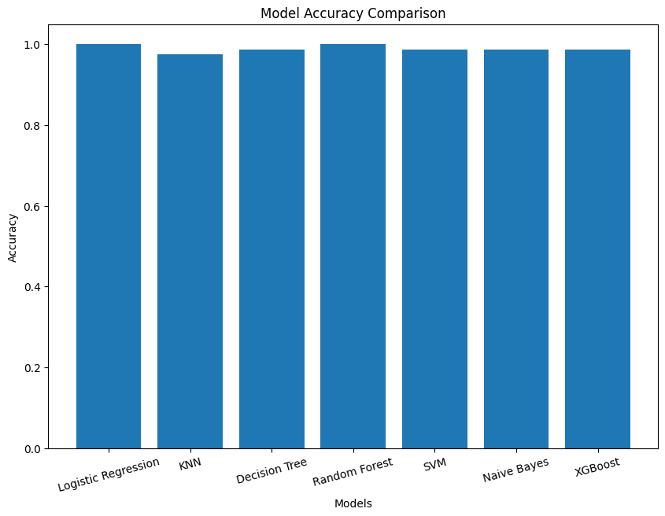
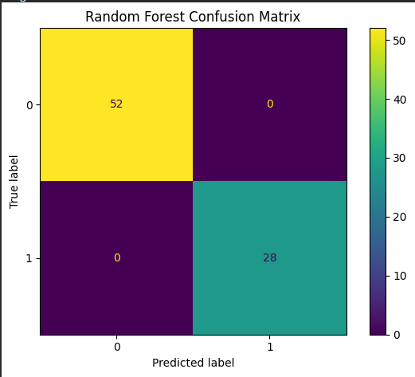
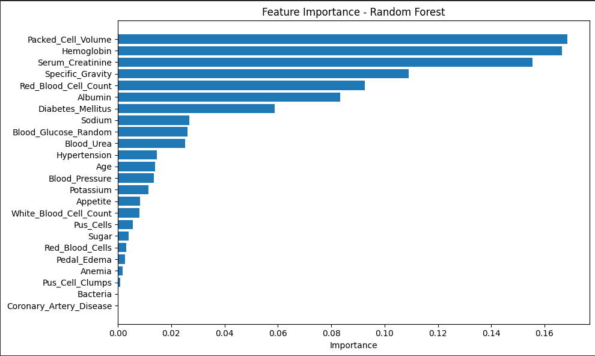

# 🩺 Chronic Kidney Disease Prediction using Machine Learning

## 📌 Project Overview

This project predicts **Chronic Kidney Disease (CKD)** using multiple supervised machine learning algorithms.  
The goal is to compare different models and select the best-performing one for accurate medical prediction.

---

## 📂 Dataset Information

- Dataset: Chronic Kidney Disease Dataset  
- Rows: 400  
- Columns: 26  
- Target: `Chronic_Kidney_Disease`

The dataset includes medical features such as:
- Blood Pressure  
- Albumin  
- Sugar  
- Hemoglobin  
- Sodium  
- Potassium  
- Diabetes Mellitus  
- Hypertension  
- Anemia  

---

## ⚙️ Data Preprocessing

The following preprocessing steps were performed:

- Handling missing values (median & mode imputation)
- Cleaning invalid entries (`?`, spaces, tabs)
- Converting data types
- Label encoding categorical features
- Feature scaling using StandardScaler (for LR, KNN, SVM)

---

## 🤖 Machine Learning Models Used

- Logistic Regression  
- K-Nearest Neighbors (KNN)  
- Decision Tree Classifier  
- Random Forest Classifier  
- Support Vector Machine (SVM)  
- Gaussian Naive Bayes  
- XGBoost Classifier  

---

## 📊 Model Evaluation Metrics

- Accuracy  
- Precision  
- Recall  
- F1 Score  
- Confusion Matrix  

---

## 🏆 Model Performance

| Model | Accuracy |
|------|----------|
| Logistic Regression | 1.0000 |
| KNN | 0.9750 |
| Decision Tree | 0.9875 |
| Random Forest | 1.0000 |
| SVM | 0.9875 |
| Naive Bayes | 0.9875 |
| XGBoost | 0.9900 |

---

## 📊 Visualizations

### 📈 Accuracy Comparison


---

### 📉 Confusion Matrix (Random Forest)


---

### ⭐ Feature Importance


---

## 🧠 Final Model Selection

Both **Logistic Regression** and **Random Forest** achieved the highest accuracy.

However, **Random Forest** was selected as the final model because:
- Better generalization
- Handles nonlinear relationships
- Robust to noise
- Provides feature importance

---

## 💾 Model Saving

```python
import joblib

joblib.dump(rf, "models/ckd_random_forest.pkl")
joblib.dump(scaler, "models/scaler.pkl")
